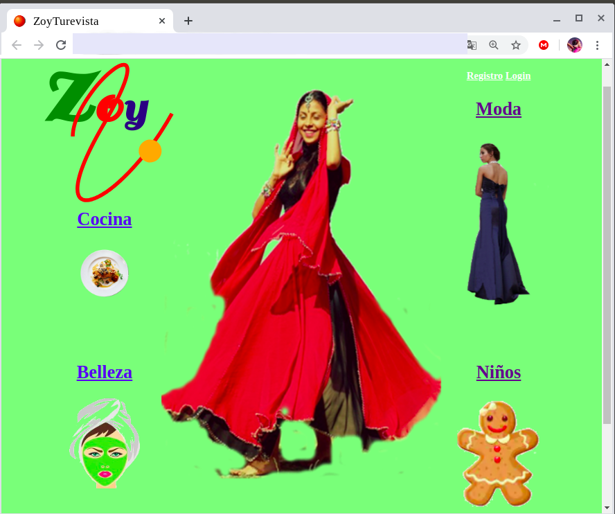

# MagicStore
## Gana regalos, descuentos y compras gratis con tus redes sociales y con tus fabulosas ideas. 
## Aplicación móvil
MagicStore es una aplicación nativa  android contra firebase y mysql con la finalidad de hacer más prácticos los servicios de la web a la que complementa.
MagicStore no guarda tus datos y sólo recaba los datos necesarios y en el momento  que los necesita:

 

El registro se completa en el momento de necesitarlo y te da la oportunuidad de eliminarlo en cuanto ya no lo necesites:

 

El usuario podrá ganar cukis, moneda interna con la que luego podrá comprar en la tienda u obtener regalos participando en campañas de redes sociales o también aportando ideas a las que podrá ademas añadir imágenes o crear sus propios diseños.

 

Mediante retrofit además de registrarse en firestore lo hace al mismo tiempo en mysql desde donde se administra todo 
lo relacionado con Cukis ganadas/gastadas obtenidas por los diferntes medios que puede ver en su aplicación también.
Implementa un WebView para facilitar el acceso a la web sin salir de la aplicación:

 

Interfaz de administrador:

 

[Enlace a video descriptivo de utilidad](https://www.youtube.com/watch?v=T10orBgETPA)

[Enlace a vídeo proyecto final](https://www.youtube.com/watch?v=PEXS_G9896k&t=35s)
[Enlace a vídeo manual de uso](https://www.youtube.com/watch?v=t1c_2H7TX5E)

## Página Web

 [Enlace a MagicStoreWeb](https://github.com/gaitaypandereta/magicStoreWeb)

 Logo de Zoy creado con svg y Anime.js en donde la bolita está en constante movimiento. 
 Zoy es un sitio web familiar con secciones infantiles, de moda, belleza y cocina.
 
 
 
 Zoy tiene actividades infantiles como ésta de arrastrar y soltar relizada mediante canvas y CreateJS:
 
 
       
 Incluye vídeo y también la opción de incluir imágenes en svg: 
   
 
 
 Zoy también muestra otros elementos más simples como audios infantiles: 
 
  
  
## Página Admin

 [Enlace a MagicStoreAdmin](https://github.com/gaitaypandereta/MagicStoreAdmin)

  Zoy tiene además una página de administración desde donde se contabilizan todas las Cukis.
  Recoge los datos de los participantes desde android por medio de retrofit y envía las cukis obtenidas 
  desde mysql también desde mysql a la apk.
  
  

  

  

  
  
[EEEnlace a MagicStore_manual_apk ] (https://github.com/gaitaypandereta/MagicStore_manual_apk)
 ## Software
   - Docker php en un principio y ya luego directamente en el servidor
   - AndroidStudio para android
   - Visualstudio code para web
   - Geany para canvas y archivos vectoriales
   - Vysor para captar pantalla móvil
   - Gimp para retoque de imágenes  
  
 ## Tecnologías
   - Canvas
   - SVG
   - javascript
   - JQuery
   - CreateJS
   - Anime.js
   - TableSorter
   - JQery
   - CSS, SASS
   - PHPMailer
   - Otto Event Bus
   - Angular
   - gridlayout y flexbox
   - PHP con PDO y prepare
   
  ## Base de datos
   - Mysql 
   - Firebase 
    
  ## Api 
   - Retrofit
 
 ## Bibliografía
   - Plataforma OpenWebinars 
   - Apuntes profesores
   - https://stackoverflow.com/
   - https://developer.android.com/
   - https://www.php.net/manual
   - https://square.github.io/retrofit/
   - https://square.github.io/retrofit/
   - https://firebase.google.com/docs

# Desarrollo del proyecto semana a semana

En cuanto a la evolución del desarrollo de este proyecto no es continuo en el tiempo sino que avanza y retrocede dependiendo de varios factores como la monetización, el mantenimiento y el desconocimiento de aspectos legales bastante complejos y querer  evitar riesgos y responsabilidades que económicamente no se podrían asumir.Éste es un proyecto real de autoempleo que una misma persona tiene que generar contenido, darle soporte, crear y promocionar productos con medios bastante rudimentarios ya que se trata de crear empresa sin apenas medios.

## Febrero

### Semana 1
   -Proyecto inicial con fragmentos inicio, login y registro con las opciones de mostrar y recuperar .

### Semana 2
   - Incorporo el fragmento desde donde se mostrarán los pots  recyclerview-viewholder.

### Semana 3
  - Creo el fragmento de opciones de  subida de archivos y el de paint y les doy funcionalidad.
  - Implemento la subida a Storage Firebase para las imágenes y los archivos creados con paint.

### Semana 4
  - Trabajo en la web.
  - Estudio el uso de Retrofit para sincronizar datos de Firebase con el backend PHP de la web.
  - Obtengo dominio y hosting y estudio y pruebo  su funcionamiento.
  - Resuelvo pequeños incidentes de configuración para que funcione prepare y PDO.
  - Comienzo con la web diseñando la base de datos y la interfaz.
  - Maqueto con gridLayout y fexbox.

## Marzo

### Semana 1
   - Sin actividad/Buscando monetización con email-marketing

### Semana 2
   - Sin actividad/Buscando monetizar proyecto contactos directos.

### Semana 3 
   - Sin actividad/Balance de material.
      
### Semana 4
   - Sin actividad
   - Solucionando temas legales sobre base datos y prestación de servicios.
   - Busco orientación en Secot y en la actualidad estamos trabajando ello.

## Abril

   ### Semana 1
   - Trabajo en la web
   - Estudio el uso de Retrofit contra el backend PHP de la web.
   - Obtengo dominio y hosting y estudio y pruebo  su funcionamiento.
   - Resuelvo pequeños incidentes de configuración para que funcione prepare y PDO.
   
   ### Semana 2
   - Comienzo con la web diseñando la base de datos y la interfaz.
   - Maqueto con gridLayout y fexbox.
   - Sigo trabajando en la web.
   - Creo el logo con svg usando path y las curvas de  Bézier  y Anime.js.
   - Imágenes con funciones svg y un canvas para arrastrar y soltar con CreateJS.
   - Galería de imágenes y el vídeo y los audios.
   - Añado fragmento de aceptar condiciones de registro en android.

### Semana 3
   - Sigo con android.
   - Añado el  fragmento de Cukis y le doy funcionalidad.
   - Implemento retrofit y lo pruebo con éxito sobre un backend jsonServer.
 
### Semana 4
   - Sigo con la web.
   - Implemento registro/login infantil sin persistencia (-son menores-) evitando así envíos maxivos al requerir más tiempo.
   - Implemento PHPMailer para el envío de cuentos y dibujitos.  
   - Implemento registro/login general contra backend PHP. 
   - Implemento la página de administración de Cukis con TableSorter con su login.
   - Comienzo con el backend PHP creando la conexión.

## Mayo
### Semana 1
   - Me documento sobre seguridad viendo varios videos de OpenWebinar
   - Incorporo un servicio de audio que al pulsar el logo comienza a contar cuentos en android. 
   - Incorporo ya los archivos web al servidor.

### Semana2 
   - Implemento webview en dos nuevos fragmentos como son index y campañas para así acceder desde la misma aplicación.

### Semana 3
   - En esta semana implemento la interfaz de administración incorporando  eventos onLongClick() y onClick(), Spinner para ordenar la salida  de RecyclerView por id o por Cukis, opción  eliminar  campaña y  menú contextual para identificar usuarios de post inadecuados o excelentes.
Añado una nueva funcionalidad a la vista personal de cada usuario para que pueda eliminar post.
Actualizo vistas vacías con imágenes y corrijo algún bug que va surgiendo.
Incorporo la librería Otto Event Bus en vez de interfaces en el manejo de datos.

### Semana 4
   - Correcciones finales en documentar y algún bug y fin de apk.

## Junio
### Semana 1 
  - Trabajo sobre la página web mejorando las vistas.
### Semana 2
  - Dedico este tiempo a la página de administración realizando el backend en php  y mejorando la interfaz.
