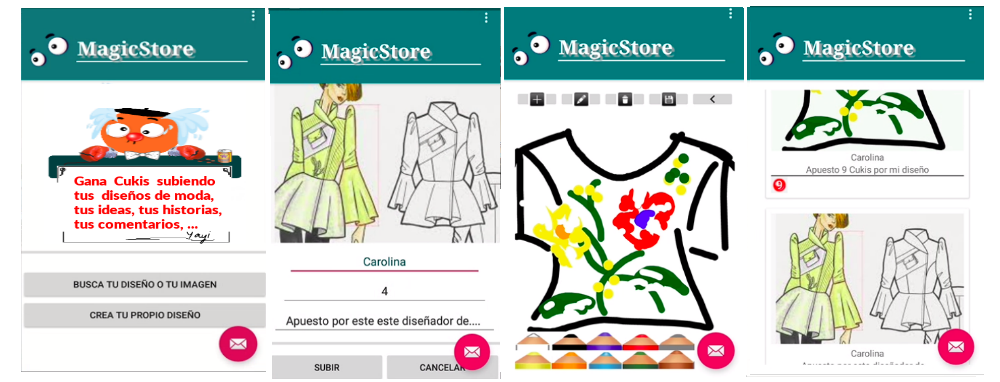

# MagicStore
## Gana regalos, descuentos y compras gratis con tus redes sociales y con tus fabulosas ideas. 
## Aplicación móvil
MagicStore es una aplicación nativa  android contra firebase y mysql con la finalidad de hacer más prácticos los servicios de la web a la que complementa.
MagicStore no guarda tus datos y sólo recaba los datos necesarios y en el momento  que los necesita:

 

El registro se completa en el momento de necesitarlo y te da la oportunuidad de eliminarlo en cuanto ya no lo necesites:

 

El usuario podrá ganar cukis, moneda interna con la que luego podrá comprar en la tienda u obtener regalos participando 
en campañas de redes sociales o también aportando ideas a las que podrá ademas añadir imágenes o crear sus propios diseños.

 

Mediante retrofit además de registrarse en firestore lo hace al mismo tiempo en mysql desde donde se administra todo 
lo relacionado con Cukis ganadas/gastadas obtenidas por los diferntes medios que puede ver en su aplicación también.
Implementa un WebView para facilitar el acceso a la web sin salir de la aplicación:

## Página Web
 Logo de Zoy creado con svg y Anime.js en donde la bolita está en constante movimiento. 
 Zoy es un sitio web familiar con secciones infantiles, de moda, belleza y cocina.
 
 
 
 Zoy tiene actividades infantiles como ésta de arrastrar y soltar relizada mediante canvas y CreateJS:
 
 
       
 Incluye vídeo y también la opción de incluir imágenes en svg: 
   
 
 
 Zoy también muestra otros elementos más simples como audios infantiles: 
 
  
  
  Zoy tiene además una página de administración desde donde se contabilizan todas las Cukis:
  
  
  
  
  
  
  
  
  
  
 ## Tecnologías
   - Canvas
   - SVG
   - CreateJS
   - Anime.js
   - TableSorter
   - JQery
   - CSS SASS
   - PHPMailer
   - Angular
   - gridlayout y flexbox
   - PHP con PDO y prepare
   
  ## Base de datos
     - Mysql 
     - Firebase 
    
  ## Api 
    - Retrofit
 
 ## Bibliografía
   - Plataforma OpenWebinars 
   - Apuntes profesores
   - https://stackoverflow.com/
   - https://developer.android.com/
   - https://www.php.net/manual
   - https://square.github.io/retrofit/
   - https://square.github.io/retrofit/
   - https://firebase.google.com/docs
